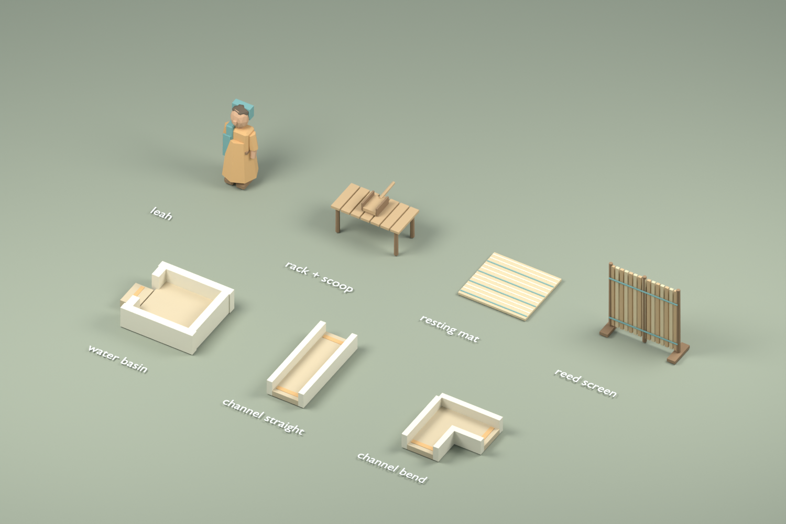
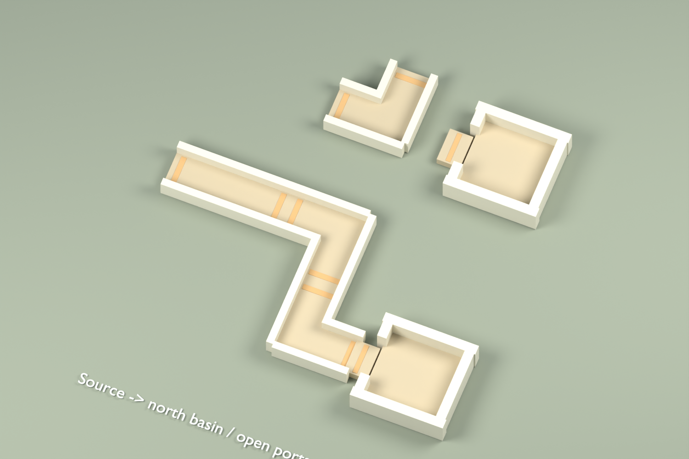
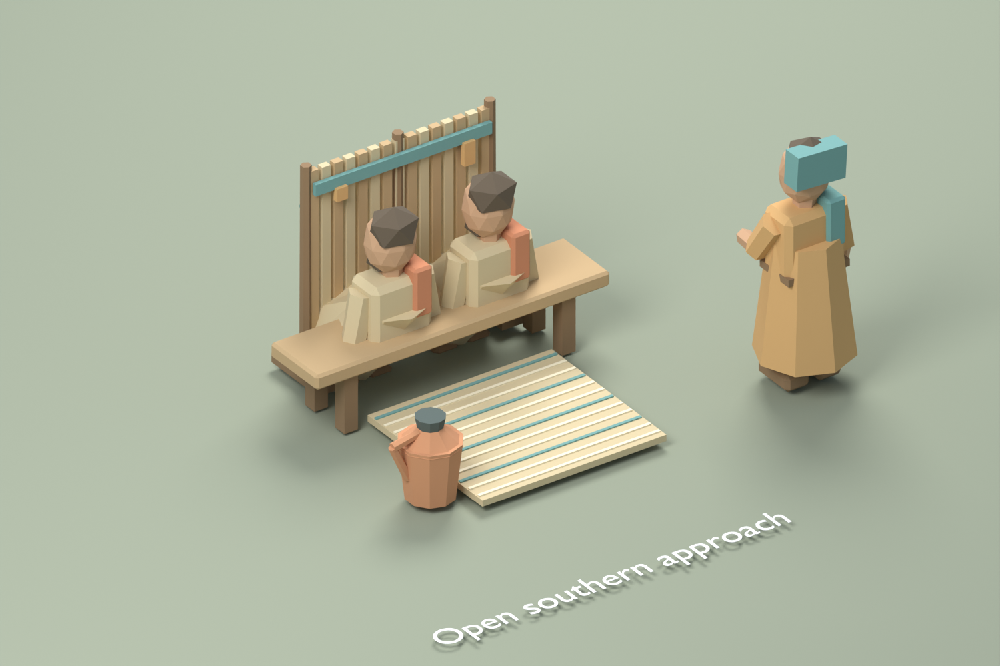

# The Journey in Your Hands — review guide

RFC-008 preserves the existing four chapters, ten optional stories and optional homecoming. It changes how a traveler finds and performs that work. The [RFC](../../rfcs/008-the-journey-in-your-hands.md) was drafted before implementation. See [verification](../../VERIFICATION.md) for actual checks and their limits.

## Start a focused review

Run `npm run fixtures:exploration` to recreate the supplied v10 review saves through the real reducers. Import a file from **Settings → Import**, then choose the indicated destination on the map. Importing replaces that browser's autosave; use an isolated local origin or export a journey you want to keep.

| Save                                                               | First destination      | What it establishes                                    |
| ------------------------------------------------------------------ | ---------------------- | ------------------------------------------------------ |
| [Fresh traveler](saves/fresh-traveler.json)                        | Journal → Your journey | The opening invitations and compact objective          |
| [Channel ready to turn](saves/channel-ready-to-turn.json)          | Entry channel          | Inspected and cleared spring, scoop returned           |
| [Shade with blocked approach](saves/shade-blocked-approach.json)   | The olive shade        | All supplies placed; southern screen blocks entry      |
| [Breeze with blocked approach](saves/breeze-blocked-approach.json) | The open resting place | The alternate site with the same recoverable problem   |
| [Screen on the road](saves/screen-on-the-road.json)                | Journal or Satchel     | Return guidance with a carried screen outside the farm |

Temporary work selection, previews, camera changes and expanded objectives are not part of these saves. They are recreated by ordinary interaction after import. Earlier v1–v9 fixtures still migrate to the same v10 progress.

## Find the next invitation

1. Open the fresh journal. Into the Deep is selected; Ezra's optional invitation appears nearby. Later locked chapters do not crowd the overview.
2. Choose **Follow the path** on Ezra's card. The selected story and route change together, but merely walking to Ezra grants no story progress.
3. Use **Show steps** and **Hide steps** on the objective. Open and close menus and perform an action; the chosen expansion should remain until the session ends.
4. Open **Stories**, change the story and status filters, then return to **Your journey**. Direct **Open story** shortcuts must open that story even after choosing Completed. People, Places, Memories, recap and full transcripts remain available.
5. Import the carried-screen save. The overview should offer a concrete return point. Import a completed journey or replay fixture from `tests/fixtures/saves`; verify completed chapters are not offered as unfinished work and the replay's return keeps the ordinary traveler intact.

## Restore either spring route

1. Select the source or a channel section. Its compact work controls leave the arrangement visible. **Read the full inspection** opens the complete readable plan; **Return to the work** or Escape restores the focused controls when still within reach.
2. Test the initial prepared channel at the source. The result should identify the entry's closed western port. Open **Help with the channel** and advance its three hints deliberately. An unsuccessful test consumes nothing.
3. Use the world or **Choose a nearby work target** to approach each section. The latter always walks to the target before enabling actions. Turn sections with empty hands and compare the orientation text with their actual open ends.
4. For the north route, set Entry east/west, Turn west/north, and North east/south. For the south route, set Entry east/west, Turn south/west, and South north/east. The unused branch can remain as it is.
5. Return to the source, test the water, and choose either closing memory. The visible wet route, reached basin and saved completion must agree.
6. Leave during a rotation, open the full inspection, open Settings, reload, or carry the scoop before finishing. Orientation, notes, hints and cleared ends persist. Completed work remains readable without a reset action.

## Arrange either resting place

1. Import either blocked-site save, select its site, and compare the placed screen with the southern-approach description.
2. Open **Preview a screen position** and choose North. A dotted outline appears at the proposed socket while the placed screen remains in its old position. The current-state description still reports the blocked approach; the proposal describes the possible arrangement.
3. Try each orientation, then **Discard preview**, leave work or open a menu. Exporting or reloading must keep the original screen orientation. Preview alone grants no checked state, visitor or memory.
4. Preview North again and choose **Use this position**. Check the resting place; the approach is now open. West also shelters the shade site; East also shelters the breeze site. The opposite exposed side remains a valid placement with an explanation that it does not shelter this seat.
5. Before completion, pick supplies up again, return them to the rack, change sites, or carry one across the road. The single carrying slot, return guidance and original guards apply to every control surface.
6. Speak with Leah and choose either memory. Reload and inspect the resulting supplies and visitors. Companion positions and unrelated stories must remain intact.

## Controls, visibility and accessibility

- Work is nonmodal. Use the top menus, select another destination, walk away or press Escape. Reading panels are modal and trap focus through their visible controls, including disclosures and the file import control.
- Keyboard activation of a rotation keeps focus on that same action when its expected orientation changes. Opening another panel before a pending animation frame must not return focus to an obsolete work surface.
- A pointer drag that returns to its starting point must not become a tap. Neither finger of a pinch may select a destination. A fresh deliberate tap should still work. Check real touch behavior separately from synthetic input coverage.
- Use large text at 390×844 and 844×390, plus an ordinary desktop size. The work body scrolls within its panel, its footer remains reachable, and the camera reserves the actual panel rectangle. The page should not overflow horizontally.
- **Frame the work** restores its authored view after manual orbit or zoom. Closing work restores the previous camera settings. Reduced motion uses immediate target follow. The target ring, approach cue and dotted proposal never obstruct travel or accept picks.
- The initial shore basket, neighborhood bread and boat landings offer **Work in the world** from their existing readable context. Boarding and docking each require a deliberate action; selecting the landing never performs either automatically.
- On a physical screen reader, check heading order, the empty-to-updated live feedback, disabled-action explanations, focus restoration and the distinction between current placement and proposal. DOM assertions do not establish assistive-technology usability.

## Assets and reproducibility

The original Blender workshop and recipe accompany the four refined GLBs. A separate Blender MCP scene imported the shipped exports for these reviews; unrelated scenes were preserved. The final [asset record](living-galilee-assets.json) hashes all 85 models, totaling 5,161,668 bytes under the original 5 MiB limit. The current screenshot and source hashes are recorded in `delivery.json`.







The Babylon tests independently verify solver ports, held-prop hand contact, footing, supply placement and preserved collision clearance. The new presentation tests project every channel section into the reserved viewport, verify every proposal socket, confirm unchanged real geometry and state, and check restoration and disposal. Browser screenshots establish the actual combined UI/world composition.

## Automated review commands

```sh
npm run typecheck
npm run lint
npm run test
npm run format:check
npm run build
npm run test:e2e
npx playwright install firefox webkit
npm run test:compat
```

Run costly local suites sequentially on a busy machine; `npm run test -- --maxWorkers=2` bounds unit-test concurrency without changing assertions or timeouts. Compatibility uses its own `.compat-dist` output and port 4175 locally. CI runs its smoke cases against the same production artifact as the complete Chromium matrix. Generated browser reports and compatibility output are excluded from source linting, formatting and development reloads.

Human pacing, editorial interpretation, sustained physical-device performance and assistive-technology acceptance still require human review. Local automation does not establish that remote GitHub Actions has run.
