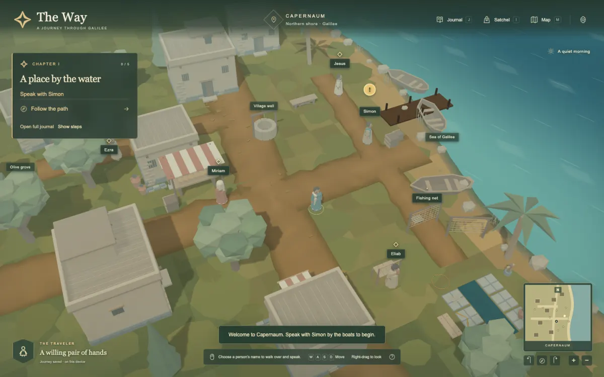
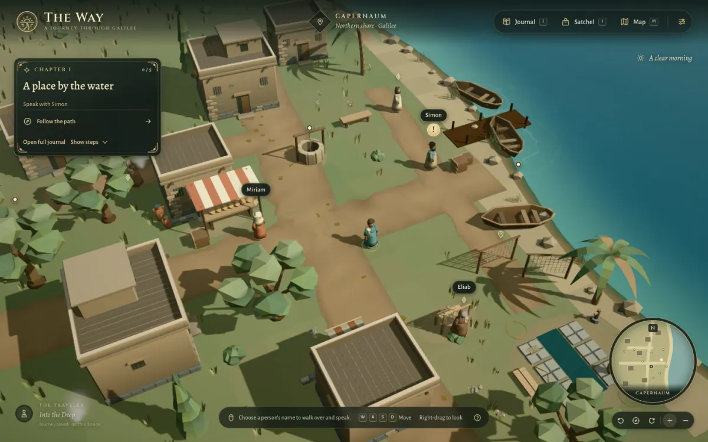
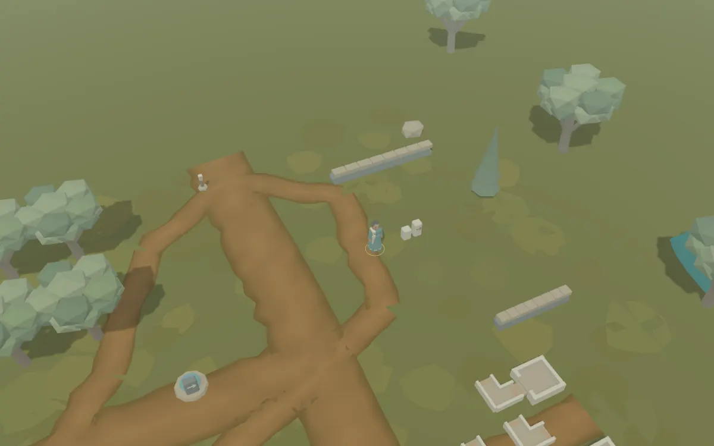
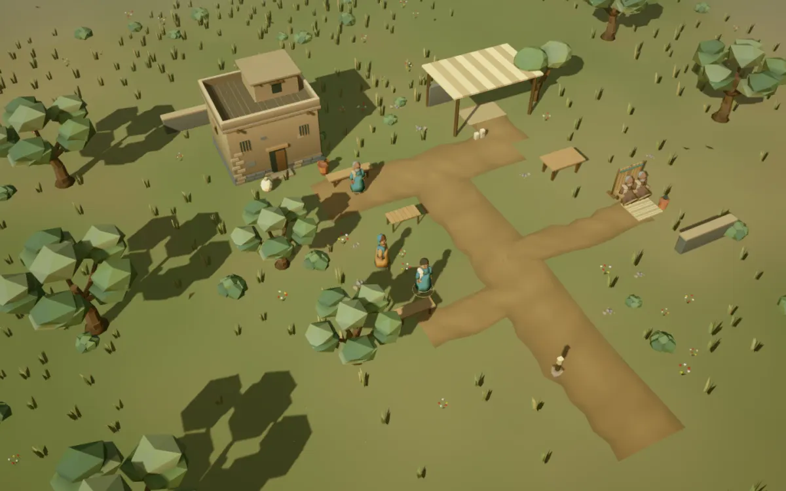
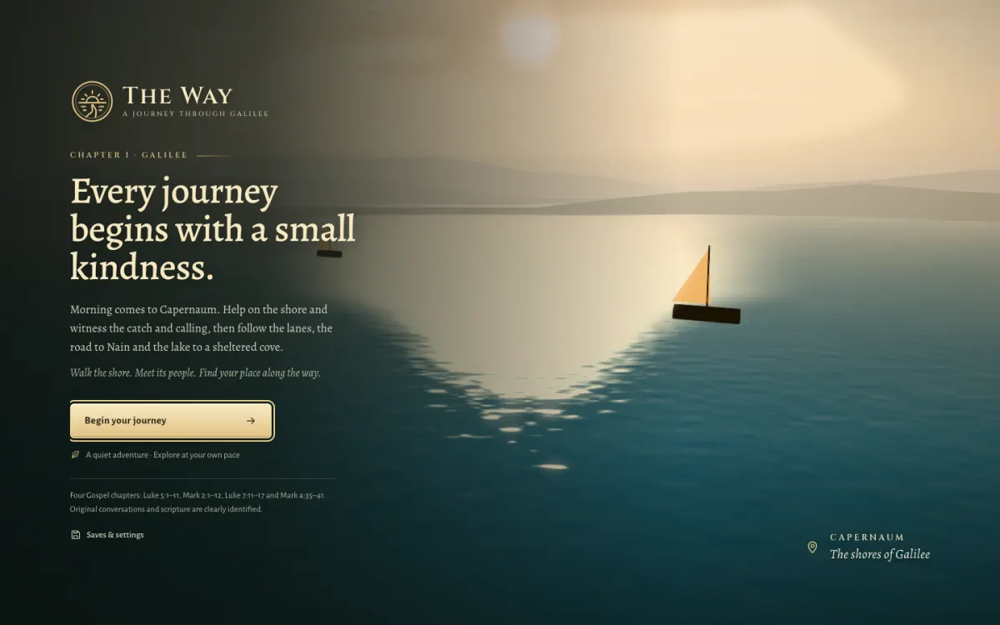
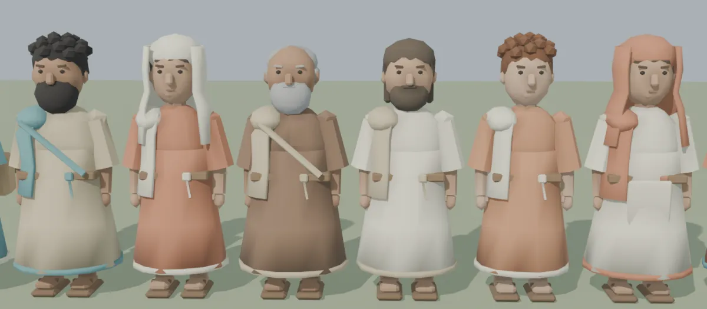

# A World in Light — review guide

This guide accompanies [RFC-011](../../rfcs/011-a-world-in-light.md). It pairs same-camera captures from before and after the milestone, the new first impression and an independent Blender review of the rebuilt people. Measurements and test outcomes are recorded in the [verification record](../../VERIFICATION.md#a-world-in-light-rfc-011).

## Before and after

The capture tool loads the same save at the same camera for every reference region and quality (`CAPTURE_LABEL=<label> npm run capture:presentation`; full output in ignored `artifacts/rfc011/captures/`). Two representative pairs are kept here.

| Before                                        | After                                       |
| --------------------------------------------- | ------------------------------------------- |
|   |   |
|  |  |

The after shore is taken at the end of the first-run arrival, with the new interface. The road pair shows the painted ground, rolling backdrop, olive groves and scattered ground cover that replace the flat field.

## First impression

The welcome surface renders over a procedural dawn over the lake (no model requests). `tools/capture/opening.spec.ts` reviews the whole first-run flow — title, cold-open cards, veil, arrival and settled view — by overriding `navigator.webdriver`, which ordinarily skips the cold open under automation.

## People

Rendered in an isolated Blender MCP workshop from the exported files: the traveler, Simon, Miriam, the elder villager, Jesus, John, Hannah and Ruth. Every actor keeps the twelve-bone rig and verified contacts; the imported-geometry tests measure rowing hands, seats, feet, rails, the reclining cushion and carried props on these exact files.

## Reviewing locally

1. `npm run capture:presentation` with `CAPTURE_LABEL=after` (and optionally `CAPTURE_ONLY=capernaum,storm-account`), then compare with a `before` capture from the baseline commit.
2. `npx playwright test --config=playwright.capture.config.ts tools/capture/opening.spec.ts` for the first-run flow.
3. In the game, try **Settings → Quality** High/Low and **Reduced motion**, press **F3** for draw calls and asset visibility, and read one scene in each Gospel account to see the eased shots.
